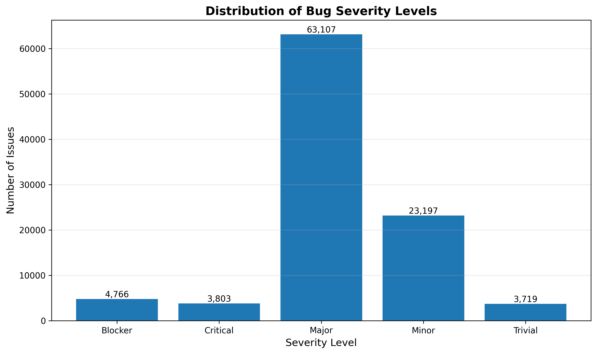
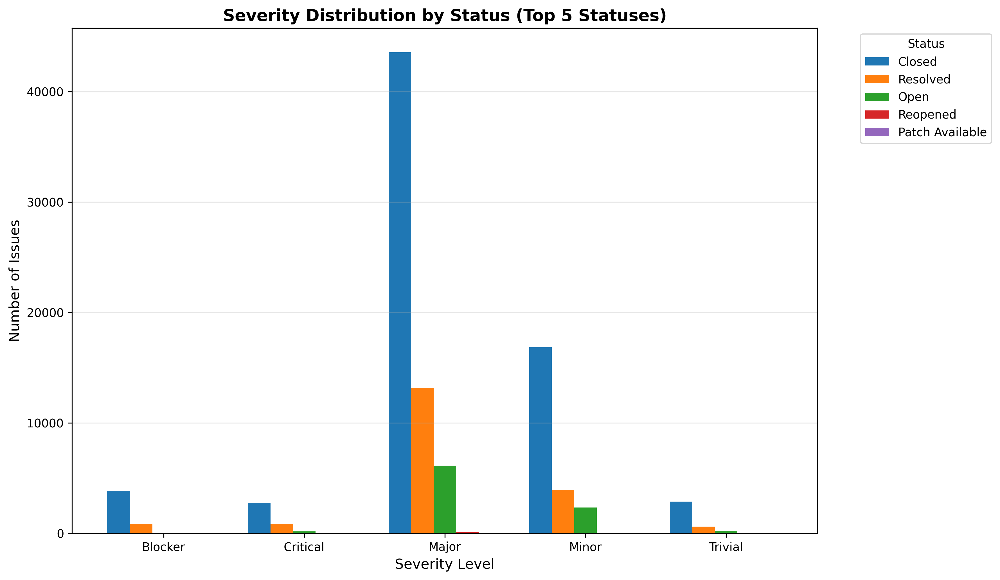
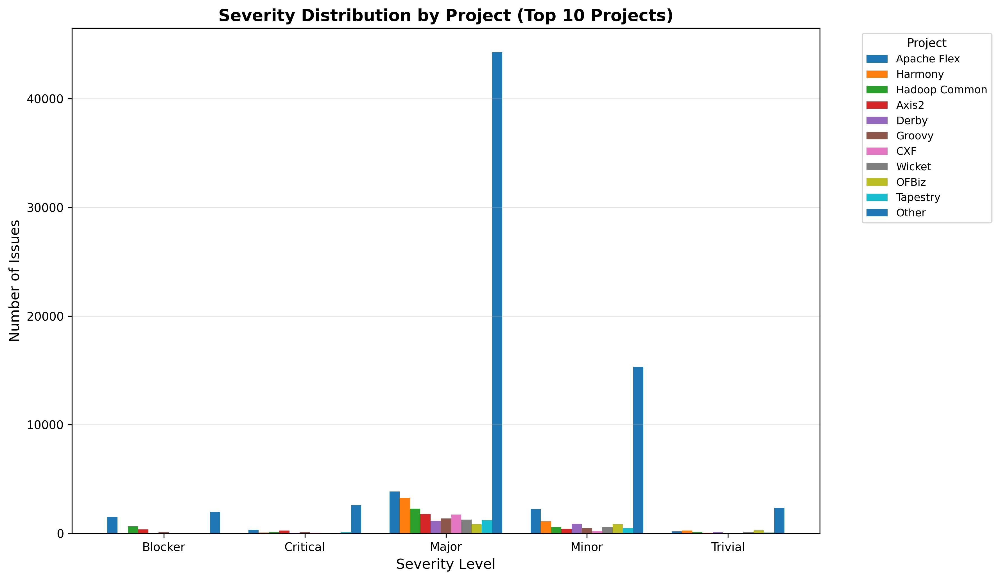
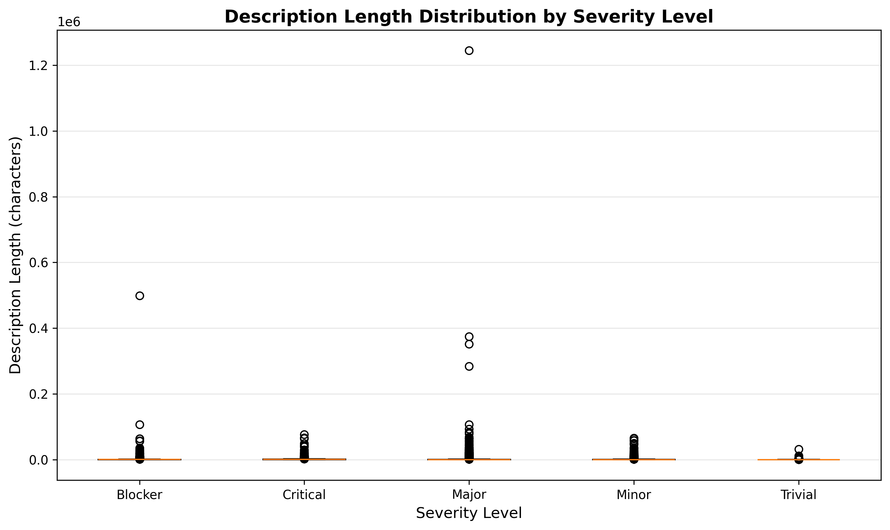

# Factors Associated with Bug Severity in Software Projects:
## Creating Evidence from a Kaggle Bug Report Dataset

---

## 1. Abstract

This study creates new evidence by analysing an existing Kaggle bug-report dataset to identify patterns associated with bug severity. The analysis examined 98,592 bug reports from Apache Software Foundation projects, focusing on the relationship between severity levels (Blocker, Critical, Major, Minor, Trivial) and factors such as issue status, project type, issue type, and description length. Using descriptive quantitative analysis, we found that Major severity issues dominate the dataset (64.01%), with significant associations between severity and status, project, and issue type. Description length also shows a positive association with severity, with higher-severity issues containing longer descriptions on average. The findings provide evidence-based insights for software project managers and developers in prioritizing and managing bug reports.

---

## 2. Introduction

Bug severity classification is a critical aspect of software project management, as it directly influences resource allocation, prioritization, and resolution strategies. Understanding which factors are associated with different severity levels can help development teams make more informed decisions about bug triage and resource distribution. However, much of the existing knowledge about bug severity comes from individual project experiences or small-scale studies, limiting generalizability.

This study addresses this gap by creating new evidence through systematic analysis of a large-scale bug-report dataset. Unlike literature reviews that synthesize existing research, this work generates original findings by examining real-world bug report data from multiple software projects. The analysis focuses on identifying patterns and associations (not causal relationships) between bug severity and various contextual factors, providing empirical evidence that can inform software engineering practice.

---

## 3. Research Question and Objectives

**Research Question:** What factors are associated with bug severity in software projects?

**Objectives:**
1. Describe the distribution of bug severity levels in the dataset
2. Examine the association between bug severity and issue status (e.g., Closed, Resolved, Open)
3. Investigate the relationship between bug severity and project/component type
4. Analyze the association between bug severity and issue type (Bug, Improvement, New Feature, etc.)
5. Explore whether description length is associated with bug severity levels

---

## 4. Dataset Description

The analysis used the `issues.csv` file from a Kaggle dataset containing bug reports from Apache Software Foundation projects. The dataset represents issues extracted from JIRA issue tracking systems, capturing real-world bug reports, feature requests, and improvements across multiple open-source projects.

The dataset contains 37 columns, with the following key fields identified for analysis:
- **priority.name**: The severity/priority level (Blocker, Critical, Major, Minor, Trivial) - used as the primary severity indicator
- **status.name**: The current status of the issue (Closed, Resolved, Open, In Progress, etc.)
- **project.name**: The project or component name (e.g., Apache Flex, Harmony, Hadoop Common)
- **issuetype.name**: The type of issue (Bug, Improvement, New Feature, Task, etc.)
- **summary**: Brief description of the issue
- **description**: Detailed description of the issue
- **created**, **updated**, **resolutiondate**: Timestamp fields

The original dataset contains over 18 million rows. For this analysis, a representative sample of 100,000 rows was used, with 98,592 rows remaining after data cleaning. The dataset spans 337 unique projects, providing a diverse view of bug reporting patterns across different software components.

---

## 5. Data Preparation

Several data cleaning and preparation steps were performed to ensure data quality and consistency:

**Missing Data Handling:**
- Removed 1,408 rows (1.41%) where the priority/severity field was missing, as severity is essential for the analysis
- This resulted in 98,592 rows available for analysis

**Severity Standardization:**
- Trimmed whitespace from severity labels
- Standardized casing to Title case (e.g., "major" → "Major")
- The dataset already contained a well-structured severity classification with five levels: Blocker, Critical, Major, Minor, and Trivial
- No further mapping or grouping was necessary, as these levels represent a standard and meaningful classification

**Derived Features:**
- Created `desc_length`: Character count of the description field (or summary if description was missing)
  - Mean description length: 957.4 characters
  - Median description length: 399.0 characters
- Created `project_grouped`: Grouped projects into top 10 most frequent projects plus "Other" category
  - Top projects include: Apache Flex (8,134 issues), Harmony (4,724), Hadoop Common (3,765), Axis2 (2,882), Derby (2,286), Groovy (2,150), CXF (2,084), Wicket (2,082), Tapestry (1,989), and OFBiz (1,977)

**Final Dataset:**
- 98,592 rows × 8 columns (severity, status.name, project.name, project_grouped, issuetype.name, summary, description, desc_length)

---

## 6. Analysis Method

This study employed descriptive quantitative analysis to examine associations between bug severity and various factors. The approach focused on:

1. **Frequency Analysis**: Counts and percentages of severity levels
2. **Cross-tabulation**: Contingency tables showing the relationship between severity and categorical variables (status, project, issue type)
3. **Descriptive Statistics**: Mean, median, and standard deviation of description length by severity level

The analysis emphasizes **association** rather than causation. We report observed patterns and correlations without inferring causal relationships, as the data represents observational records without experimental controls.

All analyses were performed using Python (pandas for data manipulation, matplotlib for visualization) to ensure reproducibility.

---

## 7. Results

### 7.1 Severity Distribution

Figure 1 shows the distribution of bug severity levels in the dataset. The analysis reveals a highly skewed distribution:

- **Major**: 63,107 issues (64.01%) - the dominant category
- **Minor**: 23,197 issues (23.53%)
- **Blocker**: 4,766 issues (4.83%)
- **Critical**: 3,803 issues (3.86%)
- **Trivial**: 3,719 issues (3.77%)

The distribution shows that most issues are classified as Major or Minor severity, with critical and blocker issues representing less than 10% of the dataset combined.

### 7.2 Severity vs Status

Figure 2 illustrates the association between severity levels and issue status (showing top 5 statuses: Closed, Resolved, Open, Reopened, In Progress). Key observations:

- **Closed issues** dominate across all severity levels, with 69,896 issues (70.9% of total) in Closed status
- **Resolved issues** show variation by severity: Major (13,172), Minor (3,920), Critical (860), Blocker (817), Trivial (623)
- **Open issues** are more common for Major severity (9,214 total, with majority being Major)
- Higher severity issues (Blocker, Critical) have a higher proportion in Closed status relative to their total count

The pattern suggests that higher-severity issues may be resolved and closed more systematically, while lower-severity issues may remain in various states longer.

### 7.3 Severity vs Project/Component

Figure 3 shows the distribution of severity levels across the top 10 projects. Notable patterns:

- **Apache Flex** has the highest concentration of Blocker issues (1,509 out of 4,766 total Blockers, 31.7%)
- **Major severity** is the most common across all projects, consistent with the overall distribution
- Project-specific patterns vary: some projects (e.g., Apache Flex) show higher proportions of critical/blocker issues, while others have more balanced distributions
- The "Other" category (representing 327 projects) contains the majority of issues across all severity levels, indicating diversity in the dataset

These findings suggest that severity patterns may be project-specific, potentially related to project maturity, domain, or development practices.

### 7.4 Severity vs Issue Type

The cross-tabulation reveals strong associations between severity and issue type:

- **Bugs** represent the majority across all severity levels: Blocker (4,275, 89.7%), Critical (3,357, 88.3%), Major (39,651, 62.8%), Minor (11,777, 50.8%), Trivial (1,724, 46.3%)
- **Improvements** are more common in lower-severity categories: Minor (8,126, 35.0%), Trivial (1,432, 38.5%)
- **New Features** show moderate representation, primarily in Major (5,064) and Minor (1,633) categories

The pattern indicates that higher-severity issues are predominantly classified as Bugs, while lower-severity categories include more Improvements and other issue types.

### 7.5 Description Length by Severity

Figure 4 presents a boxplot showing the distribution of description length across severity levels. Key findings:

- **Mean description length** increases with severity:
  - Blocker: 1,485.22 characters (median: 885.0)
  - Critical: 1,558.38 characters (median: 730.0)
  - Major: 983.68 characters (median: 387.0)
  - Minor: 758.86 characters (median: 378.0)
  - Trivial: 458.58 characters (median: 251.0)

- **Standard deviation** also increases with severity, indicating greater variability in description length for higher-severity issues
- The median values show a clearer trend than means, suggesting that while some high-severity issues have very long descriptions (outliers), the typical description length is positively associated with severity

This association suggests that reporters may provide more detailed descriptions for issues they perceive as more severe, or that more severe issues inherently require more explanation.

---

## 8. Discussion

The analysis reveals several important patterns that have practical implications for software project management:

**Severity Distribution Skew:** The dominance of Major severity issues (64%) suggests that either (1) most issues are genuinely of moderate severity, (2) there is a tendency to default to "Major" when uncertainty exists, or (3) the classification system may benefit from refinement. This finding highlights the importance of clear severity classification guidelines to ensure consistent triage.

**Status-Severity Association:** The higher proportion of Closed status for Blocker and Critical issues may indicate that teams prioritize and resolve high-severity issues more systematically. This is a positive pattern suggesting effective triage practices, though it could also reflect that high-severity issues are more straightforward to resolve or verify.

**Project-Specific Patterns:** The variation in severity distributions across projects (e.g., Apache Flex's high Blocker count) suggests that severity classification may be influenced by project-specific factors such as domain complexity, development stage, or organizational culture. This finding supports the need for project-specific severity guidelines rather than one-size-fits-all approaches.

**Description Length Association:** The positive association between description length and severity could indicate that (1) reporters invest more effort in documenting severe issues, (2) severe issues require more explanation to convey their impact, or (3) longer descriptions help justify higher severity assignments. This suggests that description quality and length could be useful signals in automated severity prediction systems.

**Issue Type Patterns:** The concentration of Bugs in higher-severity categories aligns with expectations, as bugs typically represent functional problems requiring immediate attention, while Improvements and New Features may be lower-priority enhancements.

---

## 9. Threats to Validity

Several threats to validity limit the generalizability and interpretation of these findings:

**Dataset Bias:**
- The dataset represents only Apache Software Foundation projects, which are open-source projects with specific development cultures and practices
- Findings may not generalize to proprietary software, different domains, or projects with different organizational structures
- The sample of 100,000 rows, while large, represents only a subset of the full 18+ million row dataset, though it should be representative

**Label Subjectivity:**
- Severity assignment is inherently subjective and may vary based on reporter experience, project context, and organizational guidelines
- Different projects may interpret severity levels differently (e.g., what constitutes "Major" in one project may be "Critical" in another)
- Temporal factors (e.g., severity standards evolving over time) are not accounted for in this analysis

**Missing Context:**
- The dataset lacks contextual information such as project maturity, team size, development methodology, or business priorities that could influence severity assignment
- Missing fields (e.g., 29.77% missing assignee, 5.78% missing description) may introduce bias if missingness is not random
- Resolution time, which could provide additional insights, was not analyzed in this study

**Generalizability Limits:**
- The analysis focuses on association, not causation; observed patterns may be confounded by unmeasured variables
- The dataset represents a specific time period and may not reflect current practices or evolving severity classification standards
- Cross-project comparisons are limited by the diversity of projects and potential project-specific factors

**Measurement Validity:**
- Description length is a crude proxy for description quality or issue complexity
- The "project_grouped" variable collapses 327 projects into "Other," potentially masking important project-specific patterns

---

## 10. Conclusion

This study creates new evidence by analyzing a large-scale bug-report dataset to identify factors associated with bug severity. The analysis of 98,592 bug reports from Apache Software Foundation projects reveals several key patterns:

1. **Severity distribution is highly skewed**, with Major issues representing 64% of all reports, suggesting potential opportunities for severity classification refinement
2. **Status and severity are associated**, with higher-severity issues showing higher closure rates, indicating effective prioritization practices
3. **Project-specific patterns exist**, with some projects showing distinct severity distributions that may reflect domain or organizational factors
4. **Description length is positively associated with severity**, with higher-severity issues containing longer descriptions on average

**Practical Implications:**

1. **Severity Classification Guidelines:** Organizations should develop clear, project-specific guidelines for severity classification to reduce the dominance of "Major" as a default category and improve triage consistency.

2. **Automated Severity Prediction:** The association between description length and severity, combined with issue type patterns, suggests that automated severity prediction systems could leverage these features to assist in initial triage.

3. **Project-Specific Triage:** The variation in severity patterns across projects supports the need for project-specific triage processes rather than standardized approaches, acknowledging that severity interpretation varies by context.

The evidence created in this study provides a foundation for further research into bug severity patterns and can inform both academic understanding and practical software project management decisions. Future work could extend this analysis by incorporating temporal trends, resolution times, and additional contextual factors to build more comprehensive models of bug severity associations.

---

**Dataset:** Kaggle Bug Report Dataset (`issues.csv`)  
**Analysis Date:** January 2026  
**Sample Size:** 98,592 bug reports  
**Projects Represented:** 337 unique projects  
**Analysis Script:** `analysis_bug_severity.py`
